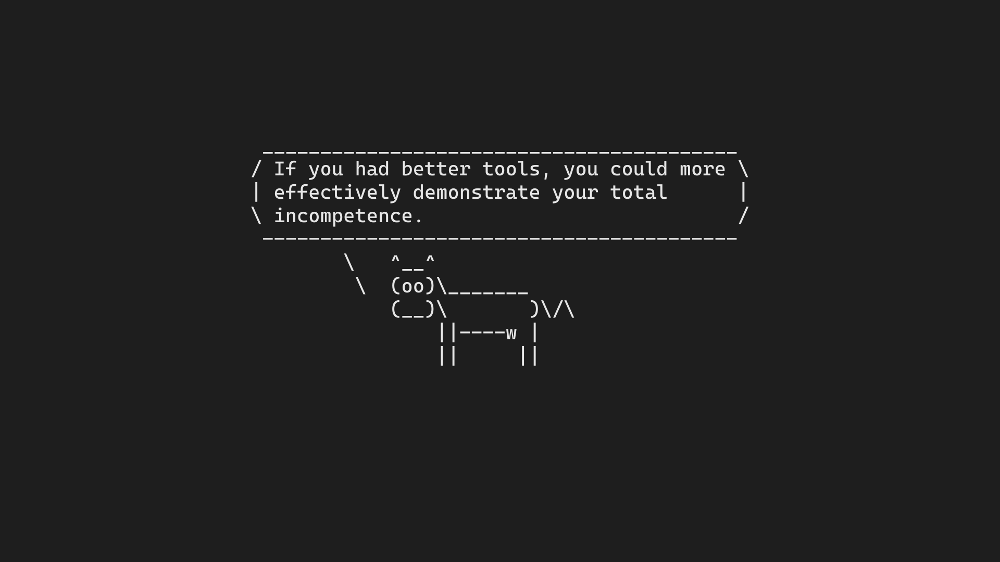

# wallcow

A program to generate minimalistic walpappers

```
Usage of wallcow:
  -bg string
        hex background color (default "1e1e1eff")
  -cmd string
        command to render on image (default: read stdin)
  -fg string
        hex font color (default "e1e1e1ff")
  -font string
        font file (now supports only ttf) (default "default")
  -o string
        output file (default "wallcow_output.png")
  -resolution string
        output image resolution WIDTHxHEIGHT (default "1920x1080")
```

`wallcow -cmd "fortune | cowsay"`

